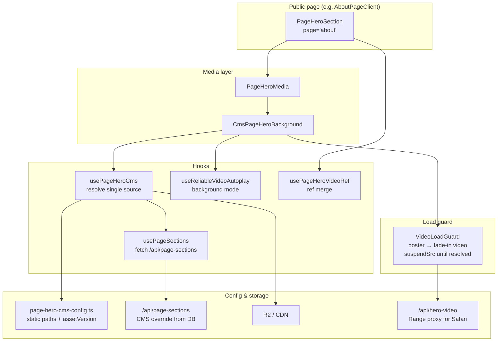

# Hero Video Assets — Implementation Guide

> **Reference implementation:** Merchandise page (`page="merchandise"`)  
> **Scope:** All public page heroes (Home, What We Do, Products, Merchandise, Authenticity, About, Journal, Distributor)  
> **Goal:** One codebase, one video lifecycle, no flash of old/default video when CMS override exists.

---

## Table of Contents

1. [Why This Architecture Works](#1-why-this-architecture-works)
2. [Architecture Overview](#2-architecture-overview)
3. [Single Video Lifecycle](#3-single-video-lifecycle)
4. [File Map](#4-file-map)
5. [Layer-by-Layer Explanation](#5-layer-by-layer-explanation)
6. [Video Asset Specification (Merchandise Standard)](#6-video-asset-specification-merchandise-standard)
7. [CMS Upload Pipeline](#7-cms-upload-pipeline)
8. [Static Defaults vs CMS Override](#8-static-defaults-vs-cms-override)
9. [Admin Hero Assets UI](#9-admin-hero-assets-ui)
10. [Deployment Requirements (ffmpeg)](#10-deployment-requirements-ffmpeg)
11. [Adding a New Page Hero](#11-adding-a-new-page-hero)
12. [Anti-Patterns (Do NOT Do This)](#12-anti-patterns-do-not-do-this)
13. [Verification Checklist](#13-verification-checklist)
14. [Cursor Prompt (Copy-Paste for New Projects)](#14-cursor-prompt-copy-paste-for-new-projects)

---

## 1. Why This Architecture Works

Before unification, each page had its own hero logic: inline `<video>`, duplicate autoplay hooks, deferred CMS fetch while static video already played, and URL swaps that caused a **1-second flash** of the old hardcoded video.

The fix is not “more fallbacks” — it is **fewer sources and one lifecycle**:

| Principle | Meaning |
|-----------|---------|
| **One component entry** | Every page uses `<PageHeroSection page="…" />` — no per-page hero video code |
| **Poster-first** | WebP poster paints instantly; video is invisible until decode completes |
| **Resolve before attach** | Do not set `<video src>` until CMS fetch finishes; then pick **one** URL (CMS or static) |
| **No URL swap playback** | Never play static video while waiting for CMS — that *is* the flash bug |
| **Merchandise standard assets** | 15s, ~6 MB, H.264 faststart, WebP poster — predictable on mobile and CDN |

Merchandise *felt* smooth because admins often **promoted** CMS video to the canonical static path (no DB override → no swap). The architecture now enforces that smoothness even when a CMS override exists.

---

## 2. Architecture Overview



### Render stack (top → bottom)

```
PageHeroSection
├── PageHeroMedia
│     └── CmsPageHeroBackground
│           ├── usePageHeroCms(page)        → poster URL + single video URL
│           ├── useShouldLoadHeroVideo()    → poster-only on save-data / 2g
│           ├── useReliableVideoAutoplay()  → muted background autoplay
│           └── VideoLoadGuard + HERO_VIDEO_MERCH_PATTERN
├── usePageHeroVideoRef(videoRef)           → ref merge + autoplay backup
├── MerchStyleHeroCopy (copy prop) OR custom children
├── HeroSeamCover (optional)
└── HeroScrollIndicator (optional)
```

---

## 3. Single Video Lifecycle

This is the **fundamental rule** for any project copying this pattern:

```
┌─────────────┐    ┌──────────────────┐    ┌─────────────────┐    ┌──────────┐
│ First paint │ →  │ Fetch CMS        │ →  │ Resolve 1 URL   │ →  │ Attach   │
│ Poster WebP │    │ (no video src)   │    │ cms ?? static   │    │ src+play │
└─────────────┘    └──────────────────┘    └─────────────────┘    └──────────┘
```

### Implementation details

1. **`usePageSections(page)`** runs immediately on mount (no idle defer).
2. While `cmsLoading === true`:
   - `heroPosterUrl` → static bundled poster (fast same-origin or R2)
   - `heroVideoPlayUrl` → `""` (empty)
   - `VideoLoadGuard` gets `suspendSrc={true}` → **no video element src attached**
3. When `cmsLoading === false`:
   - If `sections.hero.url` exists → use CMS URL only
   - Else → use static URL from `PAGE_HERO_CMS_CONFIG`
4. **One attach, one play** — no second swap.

### Code reference

```77:82:src/hooks/usePageHeroCms.ts
  const heroVideoPlayUrl = useMemo(() => {
    if (heroMediaType !== "VIDEO") return "";
    if (!cmsResolved) return "";
    const url = cmsHero?.url ?? staticMediaUrl;
    return url ? proxiedHeroVideoSrc(url) : staticVideoPlayUrl;
  }, [heroMediaType, cmsResolved, cmsHero?.url, staticMediaUrl, staticVideoPlayUrl]);
```

```79:80:src/components/hero/CmsPageHeroBackground.tsx
            forcePoster={!shouldLoadHeroVideo}
            suspendSrc={!cmsResolved || !heroVideoPlayUrl}
```

---

## 4. File Map

| Area | Path | Role |
|------|------|------|
| **Page entry** | `src/components/hero/PageHeroSection.tsx` | Unified full-viewport hero; all pages import this |
| **Media layer** | `src/components/hero/CmsPageHeroBackground.tsx` | Video/image background + overlay |
| **CMS hook** | `src/hooks/usePageHeroCms.ts` | Resolve poster + single video URL |
| **Sections fetch** | `src/hooks/usePageSections.ts` | Client fetch `/api/page-sections?page=…` |
| **Video ref** | `src/hooks/usePageHeroVideoRef.ts` | Merge refs + background autoplay |
| **Autoplay** | `src/hooks/useReliableVideoAutoplay.ts` | Safari/iOS-safe muted autoplay |
| **Load guard** | `src/components/section-media/SectionMediaLoadGuard.tsx` | Poster-first, fade-in, `suspendSrc` |
| **Static config** | `src/lib/page-hero-cms-config.ts` | Per-page videoPath, posterPath, assetVersion |
| **Media constants** | `src/lib/hero-media-defaults.ts` | `HERO_VIDEO_MERCH_PATTERN`, styles |
| **Video spec** | `src/lib/hero-cms-spec.ts` | Duration, size, CRF, poster quality |
| **Transcode** | `src/lib/transcode-page-hero-video.ts` | ffmpeg H.264 pipeline |
| **Poster extract** | `src/lib/extract-hero-poster-from-video.ts` | ffmpeg → WebP poster |
| **R2 proxy** | `src/utils/hero-video-url.ts` | `proxiedHeroVideoSrc()` for Safari Range |
| **Range API** | `src/app/api/hero-video/route.ts` | Same-origin MP4 proxy |
| **Public CMS API** | `src/app/api/page-sections/route.ts` | DB → public URLs + version |
| **Admin upload** | `src/app/api/admin/page-sections/upload/route.ts` | Upload + transcode + R2 |
| **Admin list** | `src/app/api/admin/page-sections/heroes/route.ts` | Hero assets grid data |
| **Admin UI** | `src/app/admin/(protected)/hero-assets/` | Upload, restore, promote default |
| **Admin preview** | `src/components/admin/HeroAdminPreview.tsx` | Poster-only grid preview |
| **Sync script** | `scripts/sync-all-hero-videos-merch-standard.ts` | Batch re-encode all heroes |
| **Deploy ffmpeg** | `railpack.json` | `deploy.aptPackages: ["ffmpeg"]` |

### Pages using `PageHeroSection`

- `src/components/sections/HeroSection.tsx` (Home)
- `src/app/[locale]/merchandise/MerchandisePageClient.tsx`
- `src/app/[locale]/about/AboutPageClient.tsx`
- `src/app/[locale]/products/ProductsPageClient.tsx`
- `src/app/[locale]/what-we-do/WhatWeDoPageClient.tsx`
- `src/app/[locale]/authenticity/AuthenticityPageClient.tsx`
- `src/app/[locale]/journal/JournalPageClient.tsx`
- `src/app/[locale]/distributor/DistributorPageClient.tsx`

---

## 5. Layer-by-Layer Explanation

### 5.1 `PageHeroSection` — page-level shell

Each page only declares **which hero** and **what copy** to show:

```tsx
<PageHeroSection
  page="about"
  objectPosition="center 32%"
  copy={{
    title: t("hero.title"),
    subtitle: t("hero.subtitle"),
  }}
/>
```

Or custom layout via `children` (Merchandise pattern):

```tsx
<PageHeroSection page="merchandise" showScrollIndicator={false}>
  <motion.h1>...</motion.h1>
</PageHeroSection>
```

**Do not** add `<video>` in page clients.

### 5.2 `usePageHeroCms` — media resolution

Inputs:
- `PAGE_HERO_CMS_CONFIG[page]` → static fallback paths
- `usePageSections(page)` → optional CMS override from DB

Outputs:
- `heroPosterUrl` — always available early (static poster until CMS poster resolves)
- `heroVideoPlayUrl` — **empty until CMS resolved**, then exactly one URL
- `heroVersion` / `posterVersion` — cache bust (`?v=timestamp`)
- `cmsActive` — whether DB has a hero override
- `cmsResolved` — fetch complete

### 5.3 `VideoLoadGuard` — Merchandise load pattern

Configured via `HERO_VIDEO_MERCH_PATTERN`:

```47:53:src/lib/hero-media-defaults.ts
export const HERO_VIDEO_MERCH_PATTERN = {
  posterPriority: true as const,
  lcpFriendlyPoster: true as const,
  optimizeGpu: true as const,
  lightVideoFade: true as const,
  preload: "auto" as const,
};
```

Behavior:
- Poster visible at opacity 1 immediately
- Video starts at opacity 0
- On `HAVE_CURRENT_DATA` → fade to opacity 1 (~0.22s)
- `suspendSrc` prevents attaching src until allowed
- `key` includes `heroVideoPlayUrl + heroVersion` → clean remount on asset change (no 1-frame stale decode)

### 5.4 `proxiedHeroVideoSrc` — Safari/iOS requirement

R2 URLs are proxied through `/api/hero-video?key=…` for **HTTP Range** support. Without this, iOS Safari often fails to stream MP4 hero videos.

Local paths (`/videos/hero/...`) are used as-is.

### 5.5 `useReliableVideoAutoplay`

Background mode:
- `muted`, `playsInline`, no controls
- Retries play on visibility / metadata
- `reattachKey: heroVideoPlayUrl` — re-bind when video DOM recreated (SPA navigation)

---

## 6. Video Asset Specification (Merchandise Standard)

Defined in `src/lib/hero-cms-spec.ts`:

| Rule | Value |
|------|-------|
| Max upload duration | 60 seconds |
| Published duration | **15 seconds** (trim from start if longer) |
| Target output size | **~6 MB** (ideal) |
| Hard max output | 8 MB |
| Resolution | 1080p max width, H.264 |
| Codec settings | CRF 22 → 24 → 26 → 28 until size target |
| Audio | Removed (`-an`) |
| Container | MP4 + `faststart` (moov at front) |
| Poster | WebP, quality 84, max width 1920 |

Reference file: `public/videos/hero/merchandise-hero.mp4`

Batch sync command:

```bash
npm run heroes:sync-merch-standard
```

---

## 7. CMS Upload Pipeline

**Admin flow:** `/admin/hero-assets` → Upload video → API transcode → R2 → DB

**API:** `POST /api/admin/page-sections/upload`

Form fields: `page`, `section=hero`, `type=video|image`, `file`

For hero video:
1. Probe duration (reject if > 60s)
2. `transcodePageHeroVideoForWeb()` — ffmpeg H.264
3. Upload MP4 to R2
4. `extractHeroPosterWebpFromVideo()` — WebP poster
5. Upsert `PageSection` rows: `hero` + `hero_poster`

**Requires ffmpeg on server** (see §10).

---

## 8. Static Defaults vs CMS Override

### Static default (`page-hero-cms-config.ts`)

Bundled paths served from deploy + R2 mirror:

```ts
about: {
  label: "About Us",
  mediaType: "VIDEO",
  videoPath: "/videos/hero/molten%20metal%20slow%20motion.mp4",
  posterPath: "/images/about/about-hero-poster.webp",
  assetVersion: 3,
},
```

`assetVersion` bumps when you replace files in repo — cache bust without CMS.

### CMS override (`PageSection` table)

When admin uploads, DB stores R2 key. Public API returns URL + `version = updatedAt.getTime()`.

### Promote to default (optional workflow)

Admin action **“Set as site default”** copies CMS asset to canonical static path and clears CMS override. After promote, static === CMS → zero swap, same as Merchandise in production.

---

## 9. Admin Hero Assets UI

Path: `/admin/hero-assets`

| Feature | Behavior |
|---------|----------|
| Grid preview | **Poster-only** (no video decode in admin grid — fast load) |
| Upload progress | XHR 0–100%: bytes → processing → done |
| Video upload | Server transcode via ffmpeg |
| Restore default | Remove CMS override, use static config |
| Promote default | Copy CMS → built-in path |

---

## 10. Deployment Requirements (ffmpeg)

Video CMS upload **fails without ffmpeg** on the server.

This project uses **Railway Railpack**. Configure via repo root `railpack.json`:

```json
{
  "deploy": {
    "aptPackages": ["ffmpeg"]
  }
}
```

Verify after deploy: upload a test clip in Hero Assets admin.

---

## 11. Adding a New Page Hero

1. Add slug to `PageHeroCmsSlug` and `PAGE_HERO_CMS_CONFIG` in `page-hero-cms-config.ts`
2. Place optimized MP4 in `public/videos/hero/` and WebP poster in `public/images/{page}/`
3. Run sync script or manual ffmpeg to Merchandise standard
4. In page client, use only:
   ```tsx
   <PageHeroSection page="your-slug" copy={{ ... }} />
   ```
5. Add row to admin heroes API slug list if not auto-included via `PAGE_HERO_CMS_SLUGS`
6. Test: cold load, CMS upload, no flash, mobile Safari autoplay

---

## 12. Anti-Patterns (Do NOT Do This)

| Anti-pattern | Why it breaks |
|--------------|---------------|
| Play static video, then fetch CMS after 1.4s idle | Causes flash of old video |
| Two `<video>` elements (fallback + CMS) | Double fetch, swap visible to user |
| `<video preload="metadata">` in admin grid | Slow admin previews |
| Raw R2 URL on iOS without Range proxy | Video fails or stalls on Safari |
| Per-page custom hero hooks | Drift from Merchandise behavior |
| No WebP poster | Black screen while video decodes |
| Upload 50 MB 4K source without transcode | Slow LCP, mobile data waste |
| Skip `assetVersion` / cache bust | Stale video after admin replace |

---

## 13. Verification Checklist

Use this before marking hero work complete:

- [ ] Page uses `<PageHeroSection page="…">` only — no inline hero video
- [ ] Cold load: poster visible immediately (no long black)
- [ ] With CMS override: **no flash** of previous/default video
- [ ] Without CMS: static video plays after brief poster
- [ ] iOS Safari: video autoplays muted, loops
- [ ] SPA navigation away and back: video resumes (reattachKey works)
- [ ] Admin upload: transcode succeeds, progress UI accurate
- [ ] After upload: public page shows new video without hard refresh
- [ ] ffmpeg present on production (Railpack deploy)

---

## 14. Cursor Prompt (Copy-Paste for New Projects)

Copy everything inside the block below into a **new Cursor chat** when implementing hero video assets on another Next.js project. Adjust project name and paths as needed.

---

````
You are implementing a production-grade **Hero Video Background + CMS** system. Follow this spec exactly — do not invent alternate patterns.

## Reference
Silver King by CAI — Merchandise page is the gold standard. All pages must behave identically: poster-first, single video source, no flash of old video when CMS override exists.

## Architecture (mandatory)

### Component stack
```
PageHeroSection(page)
  → PageHeroMedia
    → CmsPageHeroBackground
      → usePageHeroCms(page)
      → VideoLoadGuard (HERO_VIDEO_MERCH_PATTERN)
      → useReliableVideoAutoplay({ mode: "background", reattachKey: heroVideoPlayUrl })
  → usePageHeroVideoRef(optional forwarded ref)
  → HeroCopy (title/subtitle) OR children
```

### Single video lifecycle (critical)
1. On mount: show WebP poster immediately.
2. Fetch CMS sections from GET /api/page-sections?page={slug} (no idle defer).
3. While loading: DO NOT attach <video src> (use suspendSrc or equivalent).
4. After load: resolve ONE url = cmsHero.url ?? staticConfig.videoUrl.
5. Attach src once, fade video in after HAVE_CURRENT_DATA.
6. Never play static video while waiting for CMS — that causes flash.

### Config file (per page)
Create `page-hero-cms-config.ts`:
```ts
export type PageHeroCmsSlug = "home" | "about" | ...;

export const PAGE_HERO_CMS_CONFIG: Record<PageHeroCmsSlug, {
  label: string;
  mediaType: "VIDEO" | "IMAGE";
  videoPath?: string;
  imagePath?: string;
  posterPath: string;
  assetVersion: number;
}> = { ... };
```

### Hook: usePageHeroCms(page)
Must return:
- heroPosterUrl (available before video)
- heroVideoPlayUrl (empty string until cmsResolved)
- heroVersion, posterVersion (cache bust)
- cmsResolved (= !loading from usePageSections)
- cmsActive

Logic:
```ts
const cmsResolved = !cmsLoading;
const heroVideoPlayUrl = useMemo(() => {
  if (heroMediaType !== "VIDEO") return "";
  if (!cmsResolved) return "";
  const url = cmsHero?.url ?? staticMediaUrl;
  return url ? proxiedHeroVideoSrc(url) : "";
}, [...]);
```

### VideoLoadGuard props for hero
- posterUrl + posterVersion
- url + version
- suspendSrc={!cmsResolved || !heroVideoPlayUrl}
- posterPriority, lcpFriendlyPoster, lightVideoFade, optimizeGpu
- autoPlay, loop, muted, playsInline, preload="auto"
- key includes page + url + version (remount on asset change)

### Safari/iOS
Proxy R2/CDN MP4 through same-origin API with HTTP Range support:
`/api/hero-video?key=...`
Local /public/videos paths bypass proxy.

### Video spec (Merchandise standard)
- Max upload: 60s
- Publish: 15s trim
- Output: H.264 1080p, ~6MB target, 8MB max, faststart, no audio
- Poster: WebP quality ~84, extracted via ffmpeg
- CRF steps: 22, 24, 26, 28

Put constants in hero-cms-spec.ts. Transcode in transcode-page-hero-video.ts using ffmpeg.

### CMS upload API
POST /api/admin/page-sections/upload
- Auth admin only
- formData: page, section=hero, type=video|image, file
- Hero video: probe → transcode → upload R2 → extract poster → upsert PageSection (hero + hero_poster)
- Return { url, posterUrl }
- maxDuration 300s for ffmpeg on server

### Public CMS API
GET /api/page-sections?page={slug}
- Returns { sections: { hero: { url, mediaType, version }, hero_poster: {...} } }
- version = updatedAt timestamp for ?v= cache bust
- Cache-Control: no-store

### Admin UI
- Grid: poster-only previews (no <video> in admin cards)
- Upload: XMLHttpRequest with byte progress 0–55%, processing 55–94%, 100% on success
- Actions: restore default, promote to site default

### Deployment
Install ffmpeg on production (Railway Railpack: railpack.json deploy.aptPackages ["ffmpeg"]).

### Page usage (only allowed pattern)
```tsx
<PageHeroSection
  page="about"
  objectPosition="center 32%"
  copy={{ title, subtitle }}
/>
```
NO inline <video> in page clients. NO per-page hero hooks.

## Anti-patterns (reject if suggested)
- Deferred CMS fetch while static video already playing
- Dual video elements or dual fallback chains
- Calendar-week hero logic mixed into video layer
- Skipping poster WebP
- Direct R2 MP4 on iOS without Range proxy

## Deliverables
1. page-hero-cms-config.ts with all page slugs
2. usePageHeroCms + usePageSections hooks
3. PageHeroSection + CmsPageHeroBackground + VideoLoadGuard integration
4. hero-cms-spec.ts + transcode-page-hero-video.ts + upload route
5. /api/hero-video Range proxy
6. Admin hero assets page with upload progress
7. railpack.json or equivalent ffmpeg install
8. At least one page wired via PageHeroSection — verify no CMS flash on About-like page with CMS override

## Verification before done
- Poster instant on cold load
- CMS override: no old video flash
- iOS Safari autoplay works
- Admin upload transcodes and updates public page
- All pages use same component — no duplicate hero implementations

Read existing Silver King files if this repo is a fork:
- src/hooks/usePageHeroCms.ts
- src/components/hero/PageHeroSection.tsx
- src/components/hero/CmsPageHeroBackground.tsx
- src/lib/page-hero-cms-config.ts
- src/lib/hero-cms-spec.ts
- docs/HERO_VIDEO_ASSETS.md
````

---

## Quick Reference — One Page Integration

```tsx
import { PageHeroSection } from "@/components/hero/PageHeroSection";

export default function AboutPageClient() {
  return (
    <>
      <Navbar />
      <PageHeroSection
        page="about"
        objectPosition="center 32%"
        copy={{
          title: "The Legacy",
          subtitle: "Crafting excellence in precious metals",
        }}
      />
      {/* rest of page */}
    </>
  );
}
```

That is the entire hero video integration at the page level. Everything else is shared infrastructure.

---

*Last updated: aligns with commit implementing `usePageHeroCms` resolve-before-attach + `PageHeroSection` site-wide unification.*
